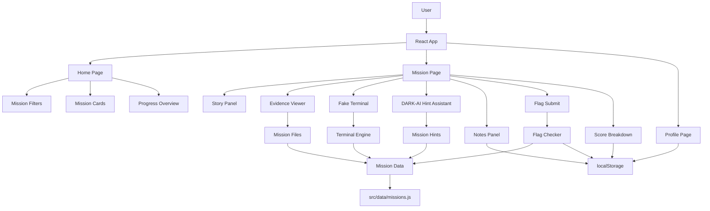
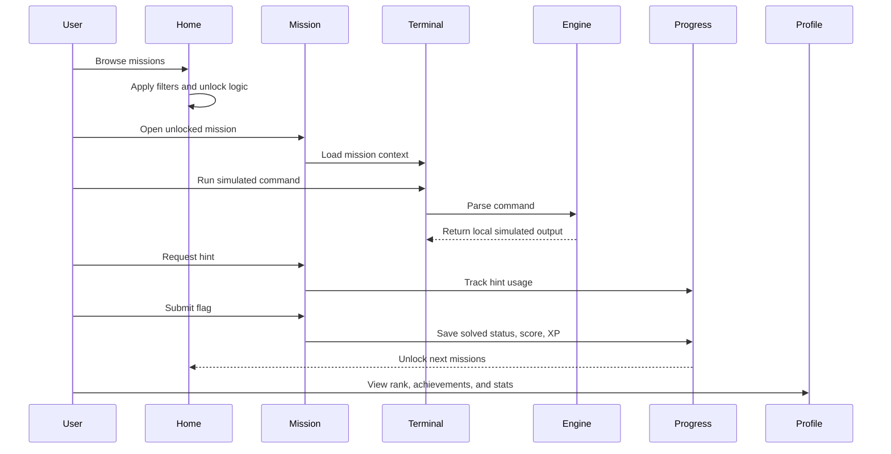
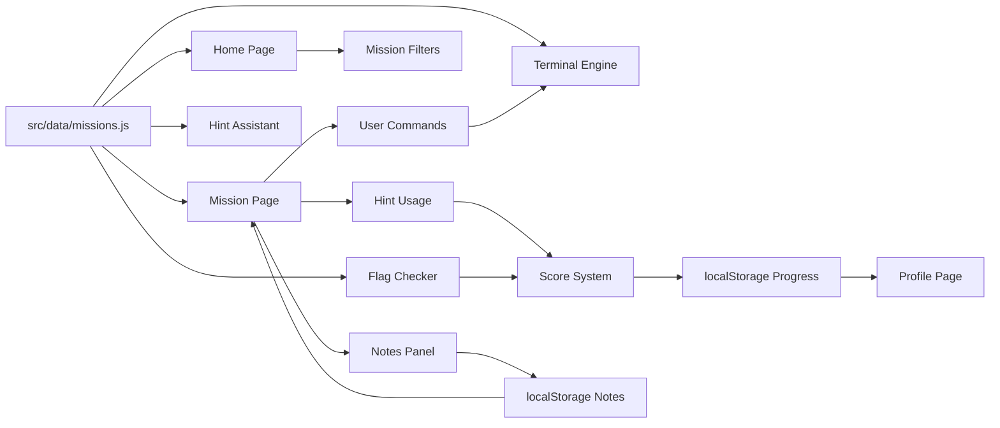

# Case404 — Cyber Detective Lab

<div align="center">

## **Case404: Season 1 — The Operator Path**

**A fictional cyber detective CTF game where players solve simulated security cases using evidence, terminal commands, hints, flags, XP, ranks, and boss investigations.**

<br />


<br />

**Built by NOtFound_404**

</div>

---

## Overview

**Case404 — Cyber Detective Lab** is a fully local, fictional, educational CTF-style cyber investigation game.

The player becomes a cyber detective and solves simulated cases by inspecting evidence files, using a safe browser-based terminal, requesting progressive hints, submitting flags, earning XP, unlocking harder missions, and completing boss investigations.

This project is designed as a cybersecurity learning game and portfolio-ready frontend project.

It does **not** use:

* real hacking targets
* real credentials
* backend services
* databases
* AI APIs
* external security tools
* real shell command execution

Everything runs locally in the browser.

---

## Live Demo

```txt
https://case404.vercel.app/
```

---

## Tagline

> Solve fictional cyber cases. Learn CTF thinking. Become the operator.

---

## Project Goals

Case404 was built to combine:

* cybersecurity education
* CTF-style thinking
* interactive frontend engineering
* game-like progression
* terminal simulation
* safe local-only security practice
* clean dark UI/UX

The main goal is to teach beginner-to-intermediate investigation patterns in a safe fictional environment.

---

## Season 1 Content

Case404 v2 expands the original MVP into a full **Season 1** experience.

### Mission Count

| Difficulty |  Count |
| ---------- | -----: |
| Easy       |      8 |
| Medium     |     10 |
| Hard       |      5 |
| Boss       |      2 |
| **Total**  | **25** |

---

## Mission Categories

The game includes fictional missions across multiple cybersecurity learning areas:

* Log Analysis
* Crypto
* Encoding
* Forensics
* Web Logic
* Stego Simulation
* OSINT-style Puzzle
* Incident Response
* Threat Hunting
* Access Review

---

## Key Features

### 25 Fictional Cyber Cases

Each mission includes:

* title
* category
* difficulty
* XP reward
* story
* objective
* evidence files
* progressive hints
* expected flag
* explanation
* recommended commands

Mission difficulty increases over time.

Easy missions usually teach one concept.
Medium missions require multiple steps.
Hard missions require deeper investigation.
Boss missions require combining clues from multiple evidence files.

---

### Safe Simulated Terminal

Case404 includes a browser-based fake terminal.

The terminal **does not execute real system commands**.
It only interacts with the current mission’s local evidence data.

Terminal prompt:

```bash
operator@case404:~$
```

Supported commands:

| Command                 | Description                                  |
| ----------------------- | -------------------------------------------- |
| `help`                  | Show available commands                      |
| `ls`                    | List current mission evidence files          |
| `cat filename`          | Read an evidence file                        |
| `grep keyword filename` | Search for a keyword inside a file           |
| `head filename`         | Show the first lines of a file               |
| `tail filename`         | Show the last lines of a file                |
| `wc filename`           | Count lines, words, and characters           |
| `strings filename`      | Extract readable strings from noisy content  |
| `find keyword`          | Search across all mission files              |
| `jsonget filename path` | Read a value from JSON using dot-path syntax |
| `decode base64 text`    | Decode Base64 text                           |
| `hexdecode text`        | Decode hexadecimal text                      |
| `urldecode text`        | Decode URL-encoded text                      |
| `rot13 text`            | Decode ROT13 text                            |
| `caesar text shift`     | Decode Caesar-shifted text                   |
| `xor text key`          | Decode simple XOR text using a key           |
| `hash text`             | Generate SHA-256 hash using Web Crypto API   |
| `sort filename`         | Sort file lines                              |
| `uniq filename`         | Remove duplicate lines                       |
| `history`               | Show command history                         |
| `submit FLAG`           | Submit a mission flag                        |
| `clear`                 | Clear terminal output                        |

---

### DARK-AI Hint Assistant

Case404 includes a simulated local assistant named **DARK-AI**.

DARK-AI gives the player progressive hints, but it is not a real AI model.

Important details:

* no OpenAI API
* no Claude API
* no Gemini API
* no backend
* no network request
* no model inference
* hints are predefined in mission data

Hint levels:

| Hint Level | Purpose                   |
| ---------- | ------------------------- |
| Hint 1     | Vague direction           |
| Hint 2     | Useful investigation clue |
| Hint 3     | Almost-solution guidance  |

This keeps the project offline, safe, predictable, and easy to run.

---

### XP and Scoring System

Each mission has a base XP value.

The final score depends on player behavior.

| Action                |    Score Effect |
| --------------------- | --------------: |
| Complete mission      |    Earn base XP |
| Use a hint            |   `-10 XP` each |
| Submit wrong flag     |    `-5 XP` each |
| Solve without hints   |  `+25 XP` bonus |
| Complete boss mission | `+100 XP` bonus |

Minimum earned XP for a solved mission cannot go below 25.

---

### Rank System

Players level up based on total XP.

|   XP | Rank                  |
| ---: | --------------------- |
|    0 | Rookie Analyst        |
|  100 | Junior Detective      |
|  300 | Cyber Investigator    |
|  700 | NOtFound_404 Operator |
| 1200 | Threat Hunter         |
| 2000 | Elite Case Breaker    |
| 3000 | Case404 Master        |

---

### Achievements

Case404 includes local achievement tracking.

Achievements include:

* First Case Solved
* No Hint Solver
* Crypto Beginner
* Log Hunter
* Pattern Finder
* Web Logic Analyst
* Boss Breaker
* 10 Cases Solved
* 25 Cases Solved
* Perfect Operator

---

### Mission Unlock System

Missions unlock progressively.

Unlock logic:

| Mission Type    | Unlock Requirement                              |
| --------------- | ----------------------------------------------- |
| First mission   | Unlocked by default                             |
| Easy missions   | Unlock sequentially                             |
| Medium missions | Unlock after solving at least 5 Easy missions   |
| Hard missions   | Unlock after solving at least 6 Medium missions |
| Boss Mission 1  | Unlock after solving 3 Hard missions            |
| Boss Mission 2  | Unlock after solving Boss Mission 1             |

This creates a clear progression path from beginner cases to advanced investigations.

---

## Boss Missions

Boss missions are multi-step investigations.

Instead of finding a single obvious clue, the player must collect multiple pieces of evidence from different files and combine them into the final flag.

Example boss-style flag format:

```txt
NOtFound404{ip_user_codename}
```

Boss missions test:

* log correlation
* evidence linking
* encoded clue recovery
* timeline analysis
* pattern recognition
* multi-file investigation

---

## Tech Stack

| Layer             | Technology     |
| ----------------- | -------------- |
| Frontend          | React          |
| Build Tool        | Vite           |
| Styling           | Tailwind CSS   |
| Language          | JavaScript     |
| Routing           | React Router   |
| State Persistence | localStorage   |
| Hashing           | Web Crypto API |
| Deployment        | Vercel         |
| Backend           | None           |
| Database          | None           |
| AI API            | None           |

---

## Architecture

Case404 is a pure frontend application.

All data, logic, progress, scoring, mission unlocks, and terminal simulation happen inside the browser.



---

## Application Flow



---

## Data Flow



---

## Folder Structure

```txt
case404-cyber-detective-lab/
  package.json
  index.html
  vite.config.js
  tailwind.config.js
  postcss.config.js
  README.md

  src/
    main.jsx
    App.jsx
    index.css

    data/
      missions.js

    pages/
      Home.jsx
      Mission.jsx
      Profile.jsx

    components/
      Navbar.jsx
      MissionCard.jsx
      Terminal.jsx
      HintAssistant.jsx
      EvidenceViewer.jsx
      FlagSubmit.jsx
      NotesPanel.jsx
      ProgressBadge.jsx

    utils/
      terminalEngine.js
      progress.js
      flagChecker.js
```

---

## Component Responsibilities

### Pages

| File          | Responsibility                                                                |
| ------------- | ----------------------------------------------------------------------------- |
| `Home.jsx`    | Landing page, mission grid, filters, search, unlock status, progress overview |
| `Mission.jsx` | Main investigation workspace for each case                                    |
| `Profile.jsx` | XP, rank, solved missions, completion percentage, scores, achievements        |

### Components

| Component            | Responsibility                                              |
| -------------------- | ----------------------------------------------------------- |
| `Navbar.jsx`         | Global app navigation                                       |
| `MissionCard.jsx`    | Mission preview card with difficulty, status, XP, and score |
| `Terminal.jsx`       | Fake terminal UI, input handling, command history           |
| `HintAssistant.jsx`  | Local progressive hint display                              |
| `EvidenceViewer.jsx` | Displays mission evidence files                             |
| `FlagSubmit.jsx`     | Handles flag submission and result feedback                 |
| `NotesPanel.jsx`     | Per-mission note taking with persistence                    |
| `ProgressBadge.jsx`  | Shows XP, rank, progress, and status badges                 |

### Utilities

| Utility             | Responsibility                                                      |
| ------------------- | ------------------------------------------------------------------- |
| `terminalEngine.js` | Parses and executes simulated terminal commands                     |
| `progress.js`       | Handles localStorage, XP, ranks, scores, achievements, unlock logic |
| `flagChecker.js`    | Validates submitted flags against mission data                      |

---

## Mission Data Model

Each mission is stored as a local JavaScript object.

Example:

```js
{
  id: "case-001",
  title: "The Suspicious Login",
  category: "Log Analysis",
  difficulty: "Easy",
  xp: 100,
  story: "A fictional company noticed suspicious login activity during the night.",
  objective: "Find the username used in the successful suspicious login.",
  files: {
    "readme.txt": "Incident happened around 02:14 AM. Check the login timeline carefully.",
    "access.log": "[02:14] failed login admin from 10.0.0.44..."
  },
  hints: [
    "Start by listing the available files.",
    "The access.log file contains the key timeline.",
    "Look for the successful login after failed attempts from the same IP."
  ],
  flag: "NOtFound404{guest_backup}",
  explanation: "The suspicious IP failed as admin and root, then successfully logged in as guest_backup.",
  recommendedCommands: ["ls", "cat access.log", "grep success access.log"]
}
```

New missions can be added by inserting new mission objects into:

```txt
src/data/missions.js
```

---

## Example Terminal Session

```bash
help
ls
cat readme.txt
cat access.log
grep success access.log
submit NOtFound404{guest_backup}
```

Example output:

```txt
Correct flag. Case solved.
XP earned: 125
Mission complete.
```

---

## Installation

Clone the repository:

```bash
git clone https://github.com/BeBecpp/Case404.git
cd Case404
```

Install dependencies:

```bash
npm install
```

Run development server:

```bash
npm run dev
```

Open the local URL shown in your terminal.

Usually:

```txt
http://localhost:5173
```

---

## Build

Create production build:

```bash
npm run build
```

Preview production build locally:

```bash
npm run preview
```

---

## Deployment

This project can be deployed easily on Vercel.

Recommended Vercel settings:

```txt
Framework Preset: Vite
Build Command: npm run build
Output Directory: dist
Install Command: npm install
Root Directory: ./
```

No environment variables are required.

---

## Safety and Ethics

Case404 is built only for safe, fictional, educational cybersecurity learning.

The project does **not** include:

* real hacking targets
* public IP/domain attacks
* real credential theft
* phishing workflows
* malware
* ransomware
* persistence
* stealth
* evasion
* destructive behavior
* backend exploitation
* live network scanning
* real shell access

The terminal is only a simulation.
It cannot access the user's real filesystem, network, operating system, browser secrets, or private data.

All missions are fictional and designed to teach safe CTF-style investigation patterns.

---

## Educational Concepts

Case404 teaches beginner-to-intermediate concepts such as:

* reading logs
* identifying suspicious login patterns
* decoding Base64
* decoding hex
* decoding URL-encoded data
* ROT13 and Caesar ciphers
* basic XOR decoding
* searching noisy evidence
* reviewing JSON data
* finding duplicate entries
* analyzing fake incident timelines
* access review logic
* threat hunting with indicators
* multi-file evidence correlation

---

## Current Season Design

```txt
Season 1 — The Operator Path
```

The player starts as a rookie analyst and gradually unlocks more complex investigations.

Progression path:

```txt
Easy Cases
   ↓
Medium Investigations
   ↓
Hard Threat Hunts
   ↓
Boss Operations
   ↓
Case404 Master
```

---

## Roadmap

Possible future upgrades:

* Add more seasons
* Add custom mission editor
* Add import/export progress
* Add writeup mode after solving missions
* Add terminal themes
* Add sound effects
* Add animated case intros
* Add daily challenge mode
* Add local leaderboard
* Add more simulated file types
* Add steganography-style visual puzzles
* Add fake packet transcript missions
* Add defensive remediation notes after each case

---

## Why This Project Matters

Case404 is more than a simple frontend demo.

It demonstrates:

* React component architecture
* state persistence with localStorage
* simulated command parsing
* dynamic mission rendering
* game progression design
* cybersecurity education design
* dark UI/UX design
* safe CTF-style challenge building
* frontend-only product development

It is built to be understandable, expandable, and portfolio-ready.

---

## Author

**BeBecpp**

Team: **NOtFound_404**

GitHub:

```txt
https://github.com/BeBecpp
```

Project Repository:

```txt
https://github.com/BeBecpp/Case404
```

Live Demo:

```txt
https://case404.vercel.app/
```

---

## License

This project is intended for educational and portfolio use.

If you want others to freely use, modify, and learn from this project, add an MIT License.

---

<div align="center">

## Case404 — Cyber Detective Lab

**Built for learning.**
**Designed for investigators.**
**Powered by curiosity.**

</div>
